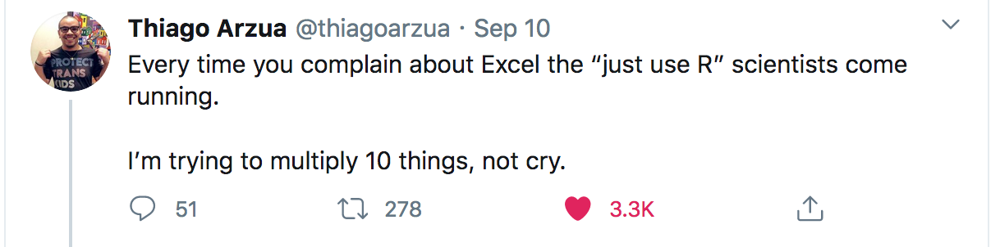

R is notoriously difficult, finicky and at times, needlessly challenging (note that I just said the same thing three times, but the repetition is for emphasis). R is also powerful, flexible and extraordinarily nimble. If you want to try out that great new thing, it's probably possible to do it in R without programming it from scratch. But, I'm not doing you any favors by pretending that learning R is easy and painless. It is hard. R is a powerful programming language, and as usual, with great power, comes *a lot* of learning, practice and preparation to know how to use those powers.

In time, you may find you truly love solving the various logic puzzles R puts before you. Or not.  Regardless, I wish you the best on your journey to learning R. This far from a comprehensive list (that's not the point), but here are a few resources to help get you started. 

## Resources for the Beginner R User 

* [RStudio Primers](https://rstudio.cloud/learn/primers)   
* [R for Excel Users](https://rstudio-conf-2020.github.io/r-for-excel/])    
* [R for Reproducible Research](https://swcarpentry.github.io/r-novice-gapminder/)   
* [Short Introduction to R](https://datacarpentry.org/R-ecology-lesson/01-intro-to-r.html)    
* [EdX short courses](https://www.edx.org/learn/r-programming)   

## Resources for the Intermediate R User

* [R 4 Data Science](https://r4ds.had.co.nz/)   
* [What They Forgot to Teach You (about R)](https://rstats.wtf/)   

## Miscellaneous very useful resources

* [RStudio cheatsheets](https://www.rstudio.com/resources/cheatsheets/)   
* [R Graphics Cookbook](https://r-graphics.org/) (a ggplot resource)   
* [Rmarkdown: the Definitive Guide](https://bookdown.org/yihui/rmarkdown/)   
* [Rweekly Blog](https://rweekly.org/) (great place to learn about updates to the R ecosystem)   
* [R Studio Resources](https://education.rstudio.com/learn/beginner/) (there's so much here!)    
* [RStudio YouTube Channel](https://www.youtube.com/c/RStudioPBC)   
* [Happy Git with R](https://happygitwithr.com/)   
* [Advanced R](https://adv-r.hadley.nz/) (book, it is rather advanced)   

