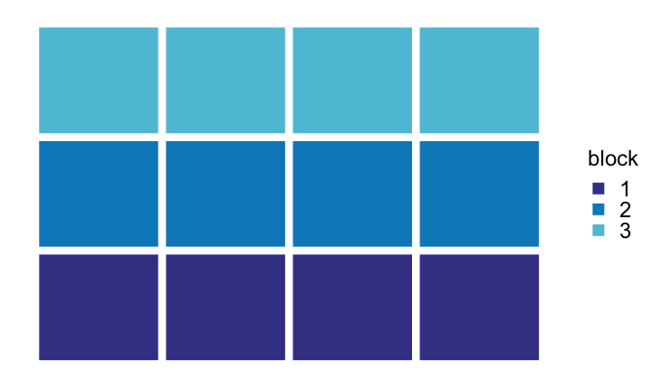
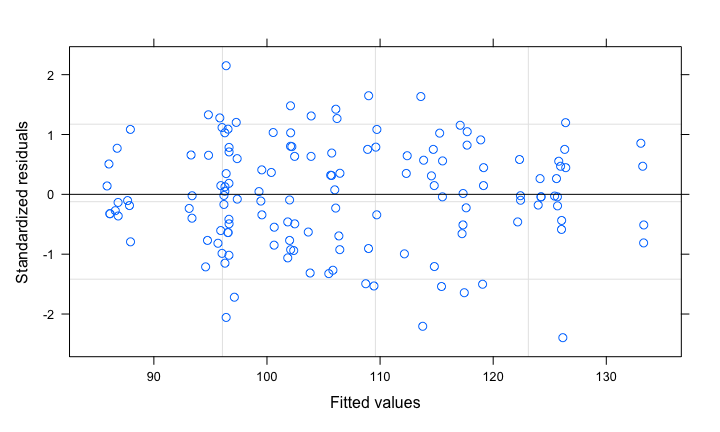
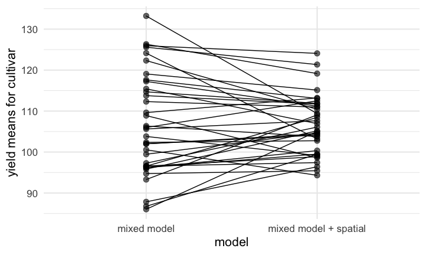

<style type="text/css">
=

ul {
  color: #282828;
  font-size: 40px;
}

</style>


##  

<div class="figure">

<p class="caption">A Road in Auvers After the Rain by Vincent Van Gogh</p>
</div>

## 
   
   
   
<center> 
### Goal: Make everyone feel more comfortable using spatial stats when analyzing field experimental data. 

(you don't have to be a geospatial statistics expert)
</center>

## Where to Find This Information

This Presentation:

    https://github.com/IdahoAgStats/lattice-spatial-analysis-talk

A longer tutorial:

    https://idahoagstats.github.io/guide-to-field-trial-spatial-analysis

<need presentation url>

## What Are Barriers to Using Spatial Stats?

  * Perceived lack of need
  * Unsure of benefits
  * No training in the topic/intimidated by the statistical methodology
  * Limited time to devote to statistical analysis
  * Unclear what would happen to blocking if spatial stats are used
  * **very few resources for easy implementation**

## Spatial Variation in Agricultural Fields

<div class="figure">

<p class="caption">Univeristy of Idaho's Parker Farm (Moscow, Idaho)</p>
</div>


##  Spatial Variation in Agricultural Fields


## Blocking in Agricultural Fields 


## Blocking versus Spatial Analysis


This is not how this works. Blocking **is** compatible with spatial analysis and recommended for most (all?) field trials.

## There Are Many Spatial Methods Available


|areal data | correlated error models |
|------------|---------------|
|row and column trend | exponential  | 
| nearest neighbor | spherical | 
|separable ARxAR models | Gaussian | 
|spatial error model | Matern |
| spatial lag model | Cauchy | 
| ARIMA | power | 
| splines | linear | 
| GAMs | many more... | 

## These Methods Work


## These Methods Can Be Complex   {.columns-2}


....But

You can also integrate spatial methods into gridded field trials without: 

1. having to know anything about map projections, shapefiles or other geospatial terminology
1. possessing a deep understanding of linear modeling techniques or empirical variograms
1. being an R or SAS programming expert

*Knowing these things is helpful, but not essential.*

## A Typical Experiment

  - Experimental treatments
  - fully crossed effects
  - Blocking scheme along the expected direction of field variation


<!-- -->


## Analysis

##### A typical linear model:

$Y_{ij} = \mu + \alpha_i + \beta_j + \epsilon_{ij}$

Response = trial mean + treatment effect + block effect + leftover error

##### We Assume: 

1. The error terms, or residuals, are independent of another with a shared distribution:

$$\epsilon_i \sim  N(0,\sigma_e)$$

2. Each block captures variation unique to that block and there is no other variation related to spatial position of the experimental plots. 

<center> **How often is #2 evaluated?** </center>

## Example Analysis

<!-- -->

## Average Yield by Row, Column and Block


## Standard Analysis of Kimberly, 2013 Wheat Variety Trial

  - 36 soft white winter wheat cultivars
  - 4 blocks
  - 2 missing data points
  - the linear model: 

$Y_{ij} = \mu + \alpha_i + \beta_j + \epsilon_{ij}$


```r
library(nlme)
lm1 <- lme(yield ~ cultivar, random = ~ 1|block, data = mydata, na.action = na.exclude)
```

## What Do The Residuals Look Like? 


```r
plot(lm1)
```

<!-- -->

## What Do The Residuals Look Like Spatially? 


<!-- -->

## What Do The Residuals Look Like Spatially? 

<!-- -->

## Global Moran's Test for Spatial Autocorrelation 

$H_0$: There is no spatial autocorrelation    
$H_a:$  There is spatial autocorrelation!  

This uses a simple weighting matrix that weights all neighbors that share a plot border (the chess-based "rook" formation) equally. 

```
## 
## 	Monte-Carlo simulation of Moran I
## 
## data:  mydata$residuals 
## weights: weights 
## omitted: 88, 97 
## number of simulations + 1: 1000 
## 
## statistic = 0.15869, observed rank = 997, p-value = 0.003
## alternative hypothesis: greater
```
## Handling Spatial Autocorrelation in Areal Data
  
Areal data = finite region divided into discrete sub-regions (plots) with aggregated outcomes 

Options: 

1. model row and column trends 
    - good for known gradients (hill slope, salinity patterns)
2. assume plots close together are more similar than plots far apart. The errors terms can be modelled based on proximity, but there is no trial-wide trend  
    - autoregressive models (AR)
    - models utilizing "gaussian random fields" for continuously varying data (e.g. point data)
    - Smoothing splines
    - nearest neighbor
  
## Basic Linear Model

$$Y_{ij} = \mu + A_i + \epsilon_{ij}$$ 
$$\epsilon_i \sim  N(0,\sigma)$$

If N = 4:  

$$e_i ~\sim N \Bigg( 0, 
\left[ {\begin{array}{ccc} \sigma^2 & 0 & 0 & 0\\ 
                            0 & \sigma^2 & 0 & 0\\ 
                            0 & 0 & \sigma^2 & 0\\
                            0 & 0 & 0 & \sigma^2
                            \end{array}  } \right] \Bigg) $$
                            
The variance-covariance matrix indicates a shared variance and all off-diagonals are zero, that is, the errors are uncorrelated. 

## Linear Model with Autoregressive (AR) Errors

Same linear model:
$$Y_{ij} = \mu + A_i + \epsilon_{ij}$$ 

Different variance structure:

$$e_i ~\sim N \Bigg( 0,  = \sigma^2
\left[ {\begin{array}{cc} 1 & \rho & \rho^2 & \rho^3 \\
                          \rho & 1 & \rho & \rho^2 \\
                          \rho^2 & \rho & 1 & \rho \\
                          \rho^3 & \rho^2 & \rho & 1 \\ 
                          \end{array} } \right] \Bigg) $$
                          
* $\rho$ is a correlation parameter ranging from -1 to 1 where 0 is no correlation and values approaching 1 indicate spatial correlation. 
* The "one" in AR1 means that only the next most adjacent point is considered. There can be AR2, AR3, ..., ARn models.

## The Separable AR1 x AR1 model  {.columns-2}


- AR1xAR1 assumes correlation in two directions, row and column. 
- It estimates $\sigma$, $\rho_{column}$, and $\rho_{row}$  
- often a good choice since plot are rectangular and hence autocorrelation will differ by direction ("anistropy")

## More Notes on Separable AR1xAR1

- From a statistical standpoint, it's one of the more intuitive models
- The implementation in R is a little shaky 
    - several packages, all hard to use and incompatible with other R packages
- It is implemented in SAS
- Some proprietary software implements this (AsREML), others do not (Agrobase)

## Semivariance and Empirical Variograms

A measure of spatial correlation based on all pairwise correlations in a data set, binned by distance apart:

$\gamma^2(h) = \frac{1}{2} Var[Z(s+h)-Z(s)]$  
$Z(s)$ = observed data at point $s$.   
$Z(s)$ = observed data at another point $h$ distance from point $s$.   

For a data set with $N$ observation, there are this many pairwise points:

$\frac{N(N-1)}{2}$

## Empirical Variogram

This uses semivariance to mathematically relate spatial correlations with distance
  

  
range = distance up to which is there is spatial correlation
sill = uncorrelated variance of the variable of interest
nugget = measurement error, or short-distance spatial variance and other unaccounted for variance
  
## Semivariance & Empirical Variograms  

  - There are many difference mathematical models for explaining semivariance:  
    - exponential, Gaussian, Matérn, spherical, ...  
  - It is usually used for kriging, or prediction of a new point through spatial interpolation  
  - It can also be used in a linear model where local observations are used to predict a data point in addition to treatment effects   
  - Bonus: R and SAS are really good at this!   
  
## Adding Semivariance to a Linear Model

Copy data into new object so we can assign it a new class (and remove missing data): 

```r
library(gstat); library(sp); library(dplyr)
mydata_sp <- mydata %>% filter(!is.na(yield))
```
Establish `coordinates` for data set to make it an `sp` object ("spatial points"): 

```r
coordinates(mydata_sp) <- ~ row + range
```
Set the maximum distance for looking at pairwise correlations: 

```r
max_dist <- 0.5*max(dist(coordinates(mydata_sp)))
```

## Adding Semivariance to a Linear Model

Calculate a sample variogram: 

```r
semivar <- variogram(yield ~ block + cultivar, data = mydata_sp,
                        cutoff = max_dist, width = max_dist/12)
nugget_start <- min(semivar$gamma)
```

## Adding Semivariance to a Linear Model

The empirical variogram: 

```r
plot(semivar)
```

<!-- -->


## Adding Semivariance to a Linear Model

Set up models for fitting variograms:

```r
vgm1 <- vgm(model = "Exp", nugget = nugget_start) # exponential
vgm2 <- vgm(model = "Sph", nugget = nugget_start) # spherical
vgm3 <- vgm(model = "Gau", nugget = nugget_start) # Gaussian
```

Fit the variogram models to the data:

```r
variofit1 <- fit.variogram(semivar, vgm1)
variofit2 <- fit.variogram(semivar, vgm2)
variofit3 <- fit.variogram(semivar, vgm3)
```


## Adding Semivariance to a Linear Model

Look at the error terms to see which model is the best at minimizing error. 


```
## [1] "exponential: 26857.3"
```

```
## [1] "spherical: 26058.3"
```

```
## [1] "Gaussian: 41861.0"
```

The spherical model is the best at minimizing error. 

## Adding Semivariance to a Linear Model


```r
plot(semivar, variofit2, main = "Spherical model")
```

<!-- -->


## Adding Semivariance to a Linear Model

Extract the nugget and sill information from the spherical variogram: 

```r
nugget <- variofit2$psill[1] 
range <- variofit2$range[2] 
sill <- sum(variofit2$psill) 
nugget.effect <- nugget/sill  # the nugget/sill ratio
```

## Adding Semivariance to a Linear Model

Build a correlation structure in `nlme`:

```r
cor.sph <- corSpatial(value = c(range, nugget.effect), 
                  form = ~ row + range, 
                  nugget = T, fixed = F,
                  type = "spherical", 
                  metric = "euclidean")
```
Update the Model:

```r
lm_sph <- update(lm1, corr = cor.sph)
```

## Compare Models - Log likelihood


```r
logLik(lm1)
```

```
## 'log Lik.' -489.0572 (df=38)
```

```r
logLik(lm_sph)
```

```
## 'log Lik.' -445.4782 (df=40)
```

## Compare Models - Post-hoc Power


```r
anova(lm1)[2,]
```

```
##          numDF denDF F-value p-value
## cultivar    35   103  1.6411   0.029
```

```r
anova(lm_sph)[2,]
```

```
##          numDF denDF  F-value p-value
## cultivar    35   103 2.054749  0.0028
```

## Compare Model Predictions


```r
library(emmeans)
lme_preds <- as.data.frame(emmeans(lm1, "cultivar")) %>% mutate(model = "mixed model")
sph_preds <- as.data.frame(emmeans(lm_sph, "cultivar")) %>% 
  mutate(model = "mixed model + spatial")
preds <- rbind(lme_preds, sph_preds)
```


## Compare Model Predictions

<!-- -->

Highest yielding wheat: 'Stephens' (released in 1977) 

## Where Was Stephens Located in the Trial?


<!-- -->

## More Notes

  - When models omit blocking, the predictions may be unchanged or they may worsen. This varies by the agronomic field, but in general, blocking a field trial and including block in the statistical model improves your experimental power and controls experimental error.
  - There is no single spatial model that fits all
  - However, using any spatial model is usually better than none at all
  - When you use spatial covariates, your estimates are better and more precise. This really does help you! 
  
## What's Next:

  - Track row and range information in your trial data set.
  - Look at the tutorial! (we will also add SAS code)
  - Try out a few models and see how it impacts your results. 
  


  
## *The Seminar Was Brought to you by...Statistical Programs!!!*

*Statistical consulting to support the College of Agriculture and Life Sciences.*

**Bill Price**, Director, bprice@uidaho.edu, AgSci307  

**Julia Piaskowski**, jpiaskowski@uidaho.edu, AgSci 305  


 
  
  
  
  
