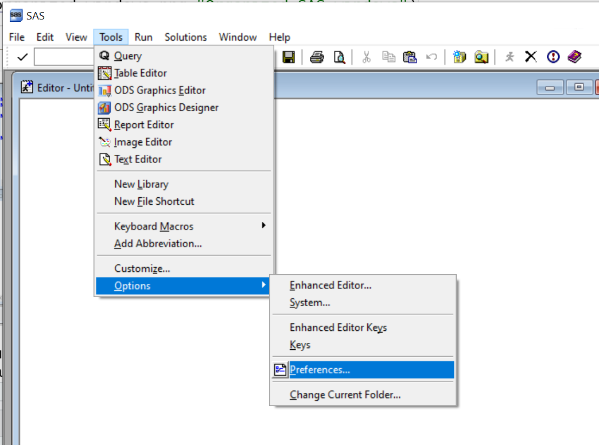
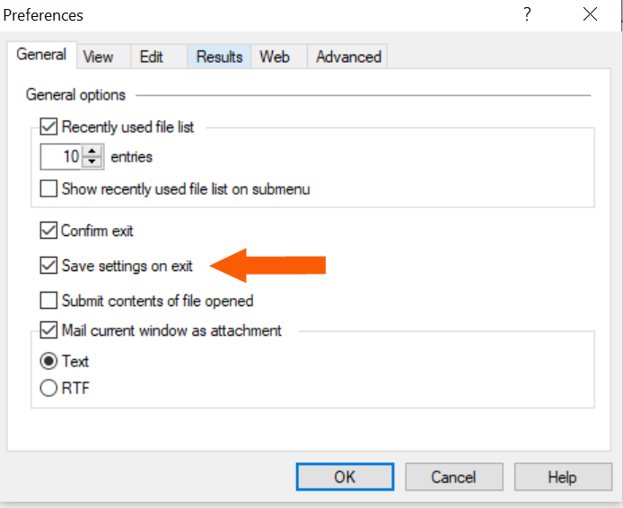
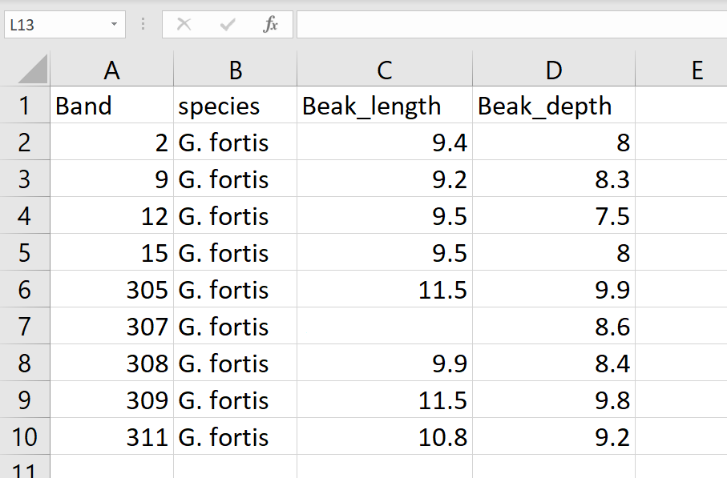
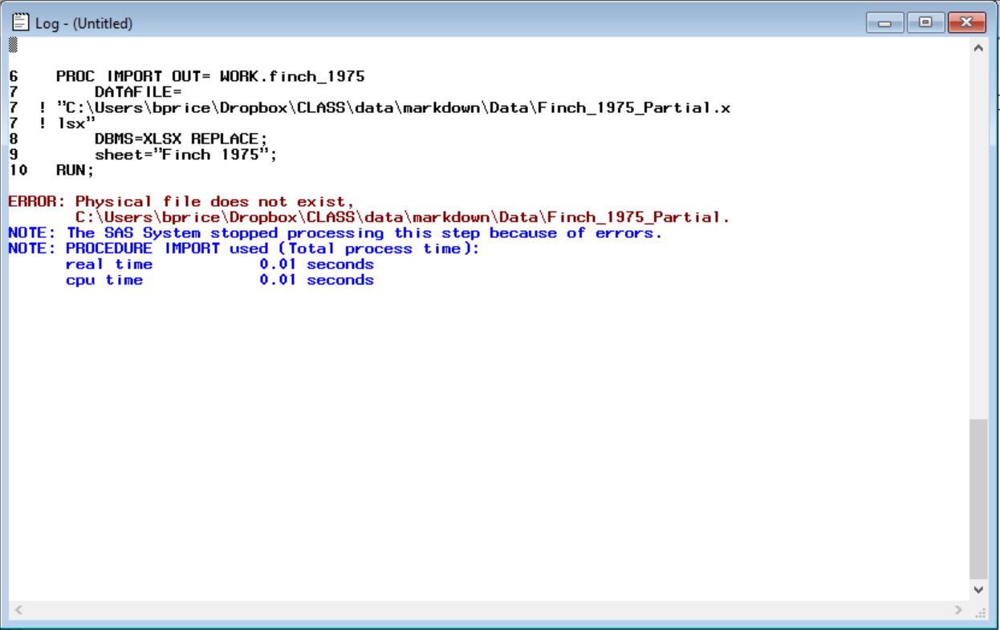
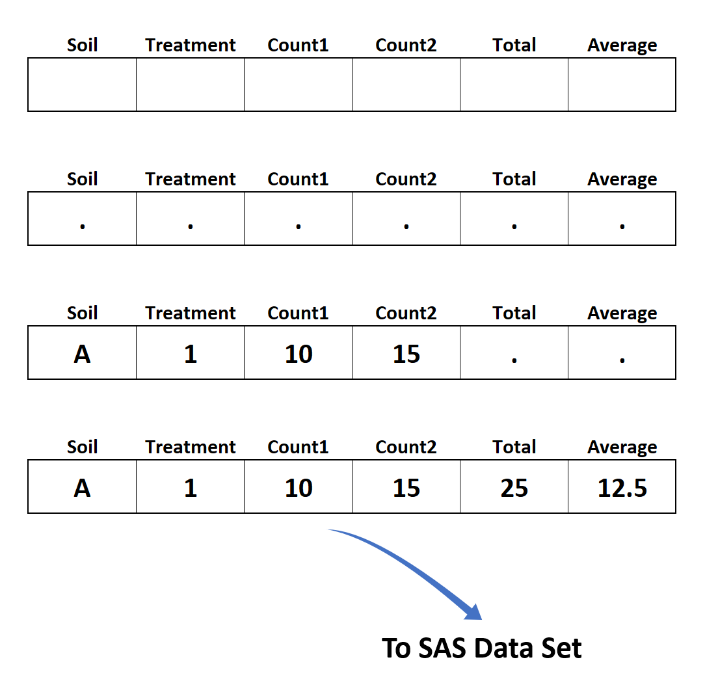

```{r setup, include=FALSE}
knitr::opts_chunk$set(echo = TRUE)
```

```{r include=FALSE}
require(SASmarkdown)

saspath <- "C:/Program Files/SASHome/SASFoundation/9.4/sas.exe"

sasopts <- "-nosplash -ls 200"
```

# Introduction
This document provides a basic introduction to the SAS system and the handling of data through the **Data Step**. No previous SAS experience is assumed. Users will need to have a licensed SAS Base product or the free [SAS University version](https://www.sas.com/en_us/software/university-edition.html){target="_blank"} installed to run the examples. Further information may also be found through the [SAS Forums](https://communities.sas.com/){target="_blank"} and [SAS Blog](https://blogs.sas.com/content/){target="_blank"} posts. A useful introductory text is [The Little SAS Book: A Primer](https://www.sas.com/store/books/categories/getting-started/the-little-sas-book-a-primer-sixth-edition/prodBK_73044_en.html){target="_blank"}.<br>

SAS is a system of data analytic tools encompassing data management, statistical analysis, graphics, reporting, and publication. SAS can be run on many different operating systems and through various user interfaces. This document will focus on running SAS in a command line framework in a Windows environment, although the basic SAS information here will translate across operating systems and interfaces. For users of Apple Mac systems, SAS can be run through either the SAS University installation mentioned above, or through a Windows SAS version installed on a virtual OS package such as [Parallels Desktop](https://www.parallels.com/pd/general/?gclid=CjwKCAjwhMmEBhBwEiwAXwFoEQrFANzM_g5KsbCx4QBlZXpSZoNrE6IwoTbXUFtbO09VrkawcpjephoCvyEQAvD_BwE){target="_blank"} (This requires a copy of Windows as well). This introduction does NOT cover SAS JMP, which is a separate point and click product for similar SAS analytical tools.<br>

# The SAS Windows Environment

When starting a SAS session, the user will be presented with several windows. In the default configuration, two overlapping windows on the left hand side are called *Results* and *Explorer*. In the demonstrations below, these windows are closed for better clarity and they will accessed separately as needed. The remaining windows represent the three basic components of a SAS session: An Editor, a Log window, and a Listing or Output window. The Editor is where SAS commands (programs) will be written and run. The Log window will provide a history of each program as it runs. This is useful for identifying errors, warnings, and general information about the results of the program being run. The Output window will provide a text version of any printed output from the program, such as analysis results, data printouts, etc. In more recent versions of SAS, this window has become somewhat redundant as a newer output presentation format is now available. These newer and cleaner looking outputs will automatically open up in a new window called *Results Viewer* when a program is run. By default, these results are produced in HTML, which can be viewed in the default SAS browser or any Web browser set by the user.<br> 

I find that reorganizing the SAS windows from their default positions and sizes is more productive. I prefer to close the Results and Explorer windows, and to make the Editor window the largest and the Log and Listing windows smaller and not overlapping. This allows me to easily see the code I am writing and watch the Log and Listing windows as needed. Each window can be accessed from the labeled tabs at the bottom of the screen.<br><br>

<br><br>

These changes, however, will only last the current SAS session. If we want them to reoccur every time we open SAS, we must modify the system preferences. This is done by navigating to the *Tools -> Options -> Preferences* drop down menu. On the *Preferences* window, under the *General* tab, check the *save settings on exit* box. Note that these changes will affect the Editor, Log, and Output windows, but not the Results and Explorer windows. As is evident here, there are also many other options that can be modified here as well.<br><br>

<br><br>


<br><br>

# SAS Structure

A SAS program consists of basically two types of components: **Data Steps** and Procedures or **PROCS**. Procedures are pre-written routines for specific tasks, such as statistical analyses, graphics, importing and exporting files, etc. The **Data Step** is designed to handle and manipulate data. In a Data Step, we use mathematical operators, functions, logical statements, and other constructs to compute or define new variables, convert variable units, change data structures, or filter and subset a larger data set. Data Steps and PROCS are written in "Blocks" of code. Blocks begin with either of the *keywords* **DATA** or **PROC** and they end with a special keyword **RUN**. Within each Block are SAS *Statements* which are usually specific to a PROC or Data Step. Statements in SAS also begin with keywords and always end with a semicolon, **;**. What the keywords are and how to write them is specific to each PROC or the general rules for the DATA Step. As with many written languages, statements can carry across multiple lines on the screen, or there can be multiple statements on a single line.  All SAS looks for is a recognized *keyword* and an ending *semicolon*. The Blocks can contain as many statements as necessary and there can be as many DATA and PROC blocks as we need to accomplish our tasks in SAS. A SAS program then consists of one or more Blocks, written in any order required to carry out our analyses. When SAS executes a program, it starts at the top of the program, reads and carries out the instructions in the first Block. It then moves sequentially down to the next Block, etc., until it reaches the end of the program.<br><br>

To run a SAS program, there are several options. The quickest is to use the run icon (a small running figure in the top menu bar). We can also use the *F8* function key, or we can select submit program from the *Run* menu bar. Note that when running SAS code, you can use the mouse to select a portion of code before using one of these options. This will run *only* the selected portion of code. Make sure to select all relevant portions of the code (including semicolons), however, or SAS will only partially run the code.<br><br>

<div class="infobox">
#### Note: SAS Legacy

As an analytical software package, SAS has been around for many years. It predates the personal computer, many storage media types, and, of course, the internet. While SAS has been updated many times, some legacy terminology remains. In "The good old days", SAS programs (and others such as Fortran) were typed into a special machine called a *Card Punch*. This machine physically translated the characters of the program to holes in an IBM punch card. Each card held one or more SAS statements, or at times a statement could take several cards. These were carefully aligned in order and put in a box or wrapped with a rubber band. The box was then typically carried to a central mainframe computer ("The computer center") and the user *Submitted* the cards to an operator who then used a *Card Reader* to put the program into the computer and *Run* it. Users would then pick up the output *Listing* at a later time. Some of this legacy has been retained through subsequent software updates in the terminolgy and language syntax such as *Cards*, *Submit*, *Run*, and *Listing*.<br>

<br><br>

<br><br>

Source: https://en.wikipedia.org/wiki/Punched_card<br>
</div><br>

# Programming Habits

## Program Format

It is a good idea to use consistent structured formatting when writing programs (SAS or otherwise). While most computer software packages are indifferent to indentation, spacing, line breaks, etc., using these features will make your programs easier for people to read and understand. The 'Block' nature of SAS lends itself to this type of formating very well. Blank lines between blocks of code also improve readability and will be ignored by SAS. The code below illustrates two examples:<br>

### BAD<br>

```{r Example1, engine="sashtml", engine.path=saspath, include=TRUE, engine.opts=sasopts, comment=""}
data new; set sashelp.class; proc sort; by height;run;
```
<br><br>

### BETTER<br>

```{r Example2, engine="sashtml", engine.path=saspath, include=TRUE, engine.opts=sasopts, comment=""}
data new;
  set sashelp.class;
run;

proc sort;
  by height;
run;

```
<br><br>
Let us ignore for a moment what exactly these codes do, but note that both sets of code will produce identical results. Remember that SAS is simply reading from keyword to semicolon, repeatedly, until it runs out of code. It does not interpret any formatting or lack of it. In the first example, all the commands are written on a single line, while the second uses line breaks, indentation, empty lines, and RUN statements to delineate Blocks. For most people, the second example is easier to read and follow. It will also be easier to interpret and debug (find & fix errors) if required. SAS makes much of this easy for the user by automatically indenting lines for you and highlighting keywords in color in its Editor. The exact type of formatting you use, however, is up to you, but you are strongly encouraged to use some type of formatting that makes your code easier to read.
<br><br>

## Commenting and Documentation

Another important aspect of programming is documenting and commenting your code. Doing so helps others (and yourself at a future date) understand your workflow in data management and analysis. This is vital for repeatability of analyses. SAS has some abilities for this through the use of special symbols to add comment lines to a program which will tell someone reading it what the programmer had in mind when they wrote the code. The special symbols tell SAS to skip these lines since they are only for us. The format to use these is: \/\* *comment written here* \*\/. Any text written between the \/\* and \*\/ will be ignored. To accomodate longer descriptive text, the comment sections can encompass multiple lines, if needed.
<br><br>

```{r Example3, engine="sashtml", engine.path=saspath, include=TRUE, engine.opts=sasopts, comment=""}

/* Read in the example data Class and sort the data by height. */
  
/*
Written by Chuck Darwin
November 24, 1859
Down House, Kent, England
*/
  
data new;
  set sashelp.class;
run;

proc sort;
  by height;
run;

```

For more information on documenting codes and scripts, recording data workflows, and repeatability in science, see [here](https://agstats.io/post/reproducible-r/){target="_blank"}.
<br><br>

# Getting Data into SAS

When data come into SAS, they are converted into a binary SAS specific format called a SAS **Data Set**. Data Sets have two part names separated by a period. The first part of the name is referred to as the *Library*. The second name is called the *Member*. A Library is simply a reference to where the data is stored on the computer. By default, this is assumed to be the memory of the computer and is referred to as the **Work** library. If you omit the fisrt part of the name, the data will be stored in the Work library. Data stored here are only persistent during the SAS session. If you restart SAS, you will need to move the data into SAS again, in order to use it. To keep data in a SAS format, we can use a *Permanent SAS Library* where we define a location on the computer to store SAS data. This is done either through the menu system, or by writing a *LIBNAME* statement into the program. Typically, permanent SAS Data Sets are not necessary as it is easy and quick enough to read the required data in once each session. Permanent Data Sets are more common when the data in question is very large and takes a long time to read into SAS. It is also advisable to only have one source file for data, not multiple copies and formats. For these reasons we will only utilize the temporary *Work* library here.<br><br>

The second part of the name, the *Member* of the library, is how you will reference the data in SAS. The name is most useful if it reflects the content of the data. For example, a member name: Finch_1835 gives us a clue that the data refers to finches collected in 1835. The full name would then be: Work.Finch_1835, although we can also leave off the *Library* name, i.e. Finch_1835, because *Work* is the default library.<br><br>

The *Member* name could be expanded to Darwin_finch_1835_beaks_length_depth. While this is more informative, it is also more cumbersome to write out and prone to mistakes. It is best to find a medium between a short terse name and and overly long one. Best practices, however, also include documenting what the data are using comments, as outlined above, as well as good repeatable data practices such as meta files, Read.me files, etc. For more on these, please see [here](https://agstats.io/post/reproducible-r/){target="_blank"}.<r><br>


<div class="infobox">
#### Note: SAS Naming Conventions

There are some basic rules for naming SAS Data Sets, which also apply to variables within the data sets. SAS names must be alpha-numeric characters, that is, letters and numbers. We cannot use characters such as periods, spaces, parentheses, commas, etc.  The only non-standard character allowed is the underscore, '_'. Names must also begin with a letter, not a number. Hence, **Finch_1835** is allowed, but **1835_Finch** is not. <br>

</div><br>

## Data Sources: Internal and External

Data to be read into SAS can be either *Internal* as part of the SAS program, or *External* as an independent file. While *Internal* data is simple to use, it will not be discussed here. Good data practices require data to be kept as a single source. Any corrections or modifications to the data should be carried out and documented through programs or scripts that start with this single data source. By incorporating data into SAS or other scripts, we create multiple copies of the data. This makes corrections and documenting the data difficult or impossible. The reader is, therefore, strongly discouraged from using *Internal* data.<br><br>

## External Data and the Data Step

The preferred means of accessing data is reading external files into SAS. SAS is extremely flexible in its ability to read various file types. Files such as text formats, common databases, and spreadssheets such as Excel are all accessible. It is even possible to define custom file formats for SAS to read, although that is beyond the scope of this tutorial. The files may consist of data that was entered manually or was created through other software or equipment, such as weather stations, data loggers, or laboratory hardware. Although there are exceptions, the files themselves are typically arranged with one observation (record) of data per line of the file. Data values (factors and variables of interest) within each line are separated or delimited by special characters. Common delimiters are spaces, tabs, and commas (Comma Separated Values; CSV). Space delimited files are the default for SAS. For this format, the data must have a *rectangular* structure. That is, all data positions, in all rows of the file, must have a value. This means that, if there is missing data, there must be place holder for that position in the file. SAS actually has many placeholder designations for missing data, each distinguishing between various reasons that a data point may be missing (e.g. data is out of range, subject didn't answer question, data record is lost, etc.). The simplest form, however, is a single period in the missing data position. Note that this differs from other software like R where missing data are recorded as the characters *NA*. This case is covered below. 


The example below illustrates a small space delimited data file for finch data having 9 lines and 4 variables per line.<br><br>

### Example: Space delimited data file
<div class="textbox">

Band 	species 	Beak_length 	Beak_depth<br>
2 fortis 9.4 8<br>
9 fortis 9.2 8.3<br>
12 fortis 9.5 7.5<br>
15 fortis 9.5 8<br>
305 fortis 11.5 9.9<br>
307 fortis . 8.6<br>
308 fortis 9.9 8.4<br>
309 fortis 11.5 9.8<br>
311 fortis 10.8 9.2<br>
</div><br>

The first line indicates that the values in each data line are: Band (the individual ID of a tagged bird), the species of the bird, followed by its respective beak length and depth. The data then follows, with each record on a separate line and spaces inserted between values. For Band 307, a missing value has been denoted for Beak length.<br><br>

This data can be read into SAS and printed using a *Data Step* and a procedure for displaying data, *PROC PRINT*:<br>

```{r Example4, engine="sashtml", engine.path=saspath, include=TRUE, engine.opts=sasopts, comment=""}

/* Read in the example shortened version of Grant 1975 finch data. */
/* Full data at https://www.pbs.org/wgbh/evolution/library/01/6/l_016_01.html */
  
data finch_1975;
  infile '.\Data\Finch_1975_Partial.txt' firstobs=2;
  input Band Species$ length depth;
run;

proc print;
run;

```


SAS uses the keyword *infile* to designate where the external data file is located. The file location (path) is given between single quotes followed by any desired options. In this case, the option *firstobs = 2* is used, forcing SAS to skip the first line of the file and start reading data on line 2. A similar option, *obs* = \<*number*\>, can be used in conjunction with *firstobs* option to read a fixed number of observations starting at the *firstobs* position from any portion of a file. For example, in the file above, the options *firstobs = 2 Obs = 3* would cause SAS to read only the first three lines of the data, starting with line 2 and proceeding through line 4. Further options related to reading only specified columns of data, long data lines, etc, are also available and information on these may be found in the SAS help system or the relevant [SAS online manuals](https://support.sas.com/en/documentation.html){target="_blank"}.<br><br>

The *infile* statement is followed by an *input* statement. The keyword *input* provides a list of the data variables in the order they will appear in the data lines of the file. The variable names in the list should follow the SAS alpha-numeric naming conventions described above. In this example, there are 4 variables. Unlike the other 3 variables, Species is a non-numeric character value. For this type of data, SAS requires a dollar sign (\$) to follow the variable name. The other variables are not modified this way and will be assumed to have the default format, numeric. This input type is called *List* input, for obvious reasons. In most cases, *List* input will be sufficient, however, should you require them, other forms of the input statement such as Column or Formatted types are also available to specify exact positions in a data line or special data types such as dates, respectively.<br><br>

An analogous example for a file that contains the value *NA* for the missing data in band 307 would be: <br><br>

```{r Example4.1, engine="sashtml", engine.path=saspath, include=TRUE, engine.opts=sasopts, comment=""}

proc format;
invalue has_NA 'NA' = .;
run;
  
data finch_1975;
  infile '.\Data\Finch_1975_Partial.NA.txt' firstobs=2;
  informat Beak_length has_NA.;
  input Band Species$ length depth;
run;

```

Here the procedure Proc Format is used to define NA as missing under the label "has_NA". In the data step, an *informat* statement is then used to call this definition for Beak_length.<br>


### Non-space Delimiters
The space delimted file is simple to set up, but it can cause issues in practice when the data values themselves contain spaces. For example, the Species name above may be recorded as *G. fortis*, indicating the genus Geospiza. If we use the default space delimited input above for this, SAS will try to read 5 data values per line instead of 4 and get out of alignment in the input sequence. Species will be set to *G.*, *length* to the value *fortis* and the length value will end up under *depth*. While this situation can be corrected by carefully aligning data values across lines and using *Formatted* input, an easier solution may be to change the delimiter character to something other than a space. A common non-space delimiter is the comma. Many software and digital equipment output files use comma separated values (CSV). In order to use these files in SAS, we add a new option, *delimiter*, to the *infile* statement. The delimiter option for a comma is intuitively given as *Delimiter = ‘,’*. SAS can also specify multiple characters as delimiters, such as *delimiter = ‘,;’* which would treat either a comma or semicolon as a separator of data values. <br><br>

### Example: Comma delimited data file and SAS code
<div class="textbox">

Band 	species 	Beak_length 	Beak_depth<br>
2,G. fortis,9.4,8<br>
9,G. fortis,9.2,8.3<br>
12,G. fortis,9.5,7.5<br>
15,G. fortis,9.5,8<br>
305,G. fortis,11.5,9.9<br>
307,G. fortis,.,8.6<br>
308,G. fortis,9.9,8.4<br>
309,G. fortis,11.5,9.8<br>
311,G. fortis,10.8,9.2<br>
</div><br>

```{r Example5, engine="sashtml", engine.path=saspath, include=TRUE, engine.opts=sasopts, comment=""}

/* Read in the example Grant finch data. */
  
data finch_1975;
  infile '.\Data\Finch_1975_Partial.csv' firstobs=2 delimiter=',';
  input Band Species$ length depth;
run;

```
<br><br>

<div class="infobox">
#### Note: Non-standard delimiter characters

Sometimes data files will have non-standard delimiter characters that are not visibly obvious when typed. A common example of this is a *Tab*. These characters must be specified in a special manner called hexadecimal, which is simply a computer code for each keyboard character, including *Tabs*. The hexadecimal codes can be found in most programming texts or through an online search. For a *Tab*, the code is *09*. Thus, the correct option for reading *Tab* delimited files would be: *delimiter = ‘09'x*. Here the “x” at the end tells SAS to treat the number *09* as a hexadecimal value. Note that the single quotes are required around the number portion, but not the x. Although it is not necessary, other characters could be specified as hexadecimal as well, e.g. a comma would be *delimiter = ‘2C’x* or a semicolon, *delimiter = ‘3B’x* where the *2C* and *3B* are the hexadecimal codes for comma and semicolon, respectively.
</div><br>

## External Data and SAS Menu System

An alternative to the *Data Step* for reading in external files is the SAS Menu System. This system handles all the details of importing data in the background while the user uses drop down menus to select the appropriate options. To start the import process, Select the *File -> Import Data* menu item. This starts a windowing dialog:<br><br>

<br><br>

From here we can select the data source *Comma Separated Values (\*.csv)*.<br><br>

<br><br>

Lastly we type in the *Member* name and click the *Finish* button.

<br><br>

To examine this data, we could issue a *proc print;* command again, or we can use the SAS Data Explorer to see the data. This is another menuing item. Select the *Explorer* icon from the top menu.<br><br>

<br><br>

Then choose the *Work* library and douible click on the Data Set (*Member*) name. This opens the data in a spreadsheet like table. Note, you cannot easily edit the data here. If you see a mistake or data problem, go back to the source file and correct the problem there. Then read in the data again.<br><br>

<br><br>

Notice here that we did not tell SAS what the vaiable names were. SAS , by default, used the first line in the file to determine these. Hence, the data file needs to be set up with valid SAS variable names in the first line of the file. We also did not need to specify the different data types, such as character for the variable Species. The SAS system was able to look at the data file and determine this itself. Using the import system is convenient for this reason. SAS will automatically determine data characteristics including data type, variable length, and how much data to read from the file.<br><br>

A closer examination of the drop down file import menu above shows listings for Excel file types. The usefulness of these options, however, is limited. Many SAS installations on our campus are for the 64 bit version, referring to the degree of numeric precision the software can handle. Most Excel installations, however, are 32 bit versions. These differences cause issues as there is an incompatibility between 64 bit SAS and 32 bit Excel and they will result in an error when using these drop down menu options. While we could either re-install consistent 32 or 64 bit versions of both programs, an easier soltuion is to use the last form of data input, *PROC  IMPORT*.<br><br>

## External Data and PROC IMPORT

The *Proc Import* procedure is a specialized routine that can read many types of data files. In fact, the drop down menuing system above is actually using *Proc Import* behind the scenes to access data files, based on the user's selections. Because of its flexibility, and the ability to directly imbed data importation into SAS programs, this should be a preferred method of reading in data.<br><br>

Suppose the finch data above were stored in an Excel file as shown [here](./Data/Finch_1975_Partial.xlsx):<br><br>

<br><br>

Similar to the *csv* and *txt* file formats, the first line or row in the data worksheet gives the SAS variable names. The data are entered in the rectangular data form used above with the exception that the missing data for Band 307 is now denoted with an empty cell. Excel formats for SAS *Do Not* use periods for missing values. The *Proc Import* statements to read in this data would be:<br><br>

```{r Example6, engine="sashtml", engine.path=saspath, include=TRUE, engine.opts=sasopts, comment=""}

/* Read in the example Grant finch data from Excel file. */
  
PROC IMPORT OUT= WORK.finch_1975
	DATAFILE= ".\Data\Finch_1975_Partial.xlsx"
	DBMS=XLSX REPLACE;
	sheet="Finch 1975";
RUN;

```

There are several options being specified here. The *Out=* option is setting what the *Member* name of the data will be in SAS. The *Datafile=* option sets the path to the data and points to the file name, while the *DBMS=* (DataBase Management System) option describes what type of data file this is (xlsx) and the *replace* option instructs the procedure to overwrite the *SAS* version of the data if it already exists, which is usually what we want. Note that, at no time, will SAS overwrite the original Excel file. The last statement *sheet=* gives the name for the specific Excel worksheet to read.<br><br>

It is also possible to read other data types with *Proc Import*. For example, the code below will use the Import procedure to read the previous csv file.<br><br>

```{r Example7, engine="sashtml", collectcode=TRUE, engine.path=saspath, include=TRUE, engine.opts=sasopts, comment=""}

/* Read in the example Grant finch data from CSV file. */
  
PROC IMPORT OUT= WORK.finch_1975
	DATAFILE= ".\Data\Finch_1975_Partial.csv"
	DBMS=CSV REPLACE;
RUN;

```

Here, the *DBMS* type has been changed to CSV, the *Datafile* path points to the correct file, and because CSV files contain no worksheets, the *sheet* statement has been omitted.<br><br>


<div class="infobox">
#### Note: Accessing open files in Excel

On most Windows machines, the default for opening, viewing, and using spreadsheets and CSV files is Excel. When Excel has a file open, it "locks" the file such that no other program can access it. For this reason, if you try to read an Excel or CSV file that is currently open in Excel, you will get the following error in the Log window stating the file does not exist:



The file, however, does exist, but SAS cannot see it because it is "Locked" from view by Excel. To correct this problem, close the file in Excel and run the import code again.

</div><br>


# Getting data out of SAS

While the primary focus above has been moving data into SAS, there are times when we would like to do the opposite and move data out of SAS for use elsewhere. As with virtually all windowing programs, it is possible to copy and paste data to, from, and between other software and SAS. Doing so, however, is *strongly discouraged* as it is not documentable and makes reproducible data management impossible. Alternatively, there are *Data Step* statements and *Menu* items for exporting data to files, or the most direct and documentable route for getting data out of SAS, another procedure *Proc Export*. The Export procedure is the corresponding converse to the Import procedure and, like its counterpart, can handle many different file types. In the programs below, SAS will export the finch data to an Excel file and to a CSV file, respectively.<br><br>

```{r Example8, engine="sashtml", engine.path=saspath, include=TRUE, engine.opts=sasopts, comment=""}

/* Export the example Grant finch data from SAS to Excel file. */
  
PROC EXPORT DATA= WORK.finch_1975
	OUTFILE= ".\data\Finch_1975_Partial_Output.xlsx"
	DBMS=XLSX REPLACE;
	sheet="Finch 1975";
RUN;

```
<br><br>

```{r Example9, engine="sashtml", engine.path=saspath, include=TRUE, engine.opts=sasopts, comment=""}

/* Export the example Grant finch data from SAS to CSV file. */
  
PROC EXPORT DATA= WORK.finch_1975
	OUTFILE= ".\Data\Finch_1975_Partial_Output.csv"
	DBMS=dlm REPLACE;
	delimiter=',';
RUN;

```
<br><br>

The Excel example is nearly identical to the Import code except we use a *Data=* option to pick up the SAS version of the finch data, and the *Datafile* option now becomes an *Outfile* option to specify the name and location of the new output file. Note that, unlike the *replace* option in the *Import* procedure, its use here *will* overwrite any existing file with that name, so be careful in naming output files. The CSV example adds two new options: *DBMS= dlm*, which stands for delimited file, and a *delimiter=','* statement that tells SAS that the delimiter should be a comma. The potential delimiter characters can be any of those referenced above in the Import section.<br><br>


# The Data Control Vector (DCV)

To better understand how SAS handles incoming data, it is useful to examine the step-by-step procedure that SAS uses when processing data. This can be
done using a conceptual structure called the Data Control Vector, or DCV. Essentially, the DCV can be thought of as a list or series of bins representing all the variables defined or used within a *DATA Step*. SAS starts the process by setting up the DCV, and then, line-by-line, modifying the components of the DCV according to the *DATA Step* statements. The process can be broken down into seven steps:<br><br>

1. Scan the *DATA Step* code for variables and establish the DCV.
2. Set all variables in the DCV to missing values (.).
3. Point to the first (or next) line of the data source.
4. Fill the DCV with values from the current line of data source.
5. Do any computations indicated by the *DATA Step*, in the order that they appear.
6. Output the DCV values to the SAS Data set.
7. Repeat steps 2 through 6 until all lines in the data source have been used.<br><br>

An example will provide more insight into the process. Suppose we have a data set already in SAS called *DCV*. It is printed out below:<br><br>

```{r Example10, engine="sashtml", collectcode=TRUE, engine.path=saspath, include=FALSE, engine.opts=sasopts, comment=""}

PROC IMPORT OUT= WORK.DCV
    DATAFILE= ".\Data\DCV_Example.csv"
    DBMS=CSV REPLACE;
RUN;
 
```
    
```{r Example11, engine="sashtml", collectcode=TRUE, engine.path=saspath, include=TRUE, engine.opts=sasopts, comment=""}
    
PROC PRINT DATA=DCV;
RUN;    
```
<br>

In this data there are four variables: SOIL, TRT, COUNT1, and COUNT2. In addition, there is a missing value for COUNT2 in the second line of the data.<br><br>

Now, if we pick up this data with a *Data* step and a *SET* statement (covered in detail below), we can add a computation to calculate the total and average of the two variables, COUNT2 and COUNT1.

```{r Example12, engine="sashtml", collectcode=TRUE, engine.path=saspath, include=TRUE, engine.opts=sasopts, comment=""}

DATA DCV;
    SET DCV;
    TOTAL = COUNT2 + COUNT1;
    AVERAGE = TOTAL/2;
RUN;

```
<br>


The process begins by scanning the *DATA* step for variables. In this case, there are the four original variables: SOIL, TRT, COUNT1, and COUNT2, and two new variables: TOTAL and AVERAGE. The creation of new variables using computational operators and definitions will be covered in detail later. For now, it suffices to say that new variables will be created as part of the *DATA* step and they will be used as additional components of the DCV. This is shown in Step 1 of the Figure below.<br><br> 

<br>

The second step is to set all variable values to missing. This is an important concept which, if ignored, can lead to confusion about the final output from a *DATA* step. This procedure ensures that all variables for all lines of the data set will have some value, even if it is missing data. The SAS data set will always maintain a full rectangular structure with no “gaps” or blank spots. The third step fills the DCV with real data from the current line of the data source. Note that, at this point, the variables TOTAL and AVERAGE are still missing. The following steps actually calculate the values of TOTAL (15 + 10 = 25) and AVERAGE (25/2=12.5). The last step is to place the resulting DCV values into the final SAS data set. The process will then be repeated for each line of data in the data source. The last Figure (3) demonstrates what happens when SAS can not complete one of the DCV steps.<br><br> 


<br>


When SAS then picks up the second line of data the DCV is filled with the available data, however, COUNT2 is missing. At the computational step, 5, SAS attempts to compute ( . - 9 = ?), that is, a missing value minus 9. This is not defined, therefore, SAS essentially does nothing. Because the variables TOTAL and AVERAGE were initially set to a missing values, they remain unchanged. The default value for any SAS variable is missing. Hence, the full rectangular data structure is maintained in the final SAS data set.<br><br>


# Working with Data in SAS

It is often the case where you will need to create a new SAS data set from data you have already read into SAS. This may involve calculating new variables, such as data transformations, changes in measurement units, creation of sums, differences, ratios, etc. It could also require the aggregation of two or more data sets together to form a new larger data set. To do these things, SAS employs two *Data* step statements, *SET* and *MERGE*, which allow manipulation of previously defined data.<br><br>


## Putting Data Sets together in SAS

### SET Statement

The SET statement serves two purposes in a *DATA* step. The first is to modify an existing SAS data set, e.g. transform variables, compute new ones, etc. Two versions of this are demonstrated below.<br><br>

```{r Example13, engine="sashtml", collectcode=TRUE, engine.path=saspath, include=TRUE, engine.opts=sasopts, comment=""}

DATA finch_1975;
    SET finch_1975;
    Ratio = Beak_length/Beak_depth;
RUN;

```
<br>

In this first example, a *DATA* step is used to re-define the existing data set *finch_1975*. The statement *SET finch_1975;* tells SAS to start with the existing data and then compute a new variable, Ratio, from the variables Beak_length and  Beak_depth. The operation of the *SET* statement is identical to that of the INPUT and INFILE statements shown earlier. SAS will pull observations from the data set *finch_1975*, one by one, using the DCV for processing. When this *Data* step is finished, the data set *finch_1975* will be re-defined to have all of the original variables, and an additional new variable, Ratio. Care should be taken when using this revision technique as it can overwrite existing data. If in doubt, use the technique described next.<br><br>

```{r Example14, engine="sashtml", collectcode=TRUE, engine.path=saspath, include=TRUE, engine.opts=sasopts, comment=""}

DATA ratio_finch_1975;
    SET finch_1975;
    Ratio = Beak_length/Beak_depth;
RUN;

```
<br>

In this second example, the code is identical to the first, with the exception of having different names in the *DATA* and *SET* statements. This has the effect of defining a new copy of the original data set. When the *DATA* step is finished, there will be two data sets, *finch_1975* and *ratio_finch_1975*. The first will be unchanged and identical to the original, while the second will have all the original information plus the addition of the new variable Ratio. <br><br>

The other use of the SET statement is to bring together or aggregate two or more existing data sets. A SET statement will do this by conceptually stacking the data sets vertically on top of one another in the order that they are listed. The example below shows two data sets, EXP1 and EXP2. The two sets have  variables SOIL, TRT, and COUNT2 in common, but not the other "COUNT" variables. <br><br>

**EXP1**

| **SOIL** | **TRT** | **COUNT1** | **COUNT2**|
|:----:|:---:|:------:|:------:|
|   A  |  1  |   10   |   15   |
|   A  |  2  |    9   |   12   |
|   B  |  3  |   11   |   16   |
|   B  |  4  |   10   |   11   |

<br>

**EXP2**

| **SOIL** | **TRT** | **COUNT2** | **COUNT3**| **COUNT4**|
|:--------:|:-------:|:----------:|:---------:|:---------:|
| A | 1 | 15  | 10| 5|
| B | 3 | 16 | 10 | 2|
| B | 4 | 11 | 5 | 0|
<br>

```{r Example15, engine="sashtml", collectcode=TRUE, engine.path=saspath, include=FALSE, engine.opts=sasopts, comment=""}

DATA EXP1;
    INPUT SOIL $ TRT COUNT1 COUNT2;
    CARDS;
    A   1   10  15
    A   2   9   12                           
    B   3   11  16
    B   4   10  11
    ;
run;
    
DATA EXP2;
    INPUT SOIL $ TRT COUNT2 COUNT3 COUNT4;
    CARDS;
    A   1   15  10  5                          
    B   3   16  10  2
    B   4   11  7   0
    ;
run;
```
<br>


The following code uses the *SET* statement to "stack" these data sets on top of one another into a new data set, BOTH.<br><br>

```{r Example16, engine="sashtml", collectcode=TRUE, engine.path=saspath, include=TRUE, engine.opts=sasopts, comment=""}
DATA BOTH;
  SET EXP1 EXP2;
RUN;

PROC PRINT DATA=BOTH;
TITLE1 'SET statement with EXP1 and EXP2';
RUN;
```

Variables of the same name will be aligned in the new data set, while those with different names will not. Due to the processing of the DCV, variables which occur in one data set, but not in the other, will be filled in with missing values. This type of SET statement could be used with any number of data sets. In fact, the first type of SET statement using just a single data set is only a special case of this example.<br><br>

### MERGE Statement

Another means of joining data sets is the *MERGE* statement. The effect of a *MERGE*, however, is to join the data sets together side-by-side. Merging data sets can be very useful, however, care must be taken when doing so. For example, using the two data sets shown above, a MERGE can be performed as shown below:<br><br>

```{r Example17, engine="sashtml", collectcode=TRUE, engine.path=saspath, include=TRUE, engine.opts=sasopts, comment=""}
DATA BOTH_A;
  MERGE EXP1 EXP2;
RUN;

PROC PRINT DATA=BOTH_A;
TITLE1 'Straight MERGE statement with EXP1 and EXP2';
RUN;
```


While the *DATA* step form is similar to the *SET* statement, the results are not as probably intended. What has happened is that SAS first picked up data from the data set EXP1, filled in the DCV, and then picked up data from the data set EXP2. For observation number one, this was fine. The values for the variables that the two data sets have in common (SOIL, TRT, and COUNT2) were the same in both data sets. The values for variables that were not common to both were filled in by the respective data sets. In observation two, however, things go awry. The values for SOIL, TRT, and COUNT2 in EXP1 (A, 2, and 12, respectively) are different from the second data set and are overwritten by the corresponding values from data set EXP2 (B, 3, and 16). A similar mismatch happens in observation three. A straight *MERGE* of this type can obviously lead to unintended consequences and should, therefore, be used cautiously. To work properly, the two data sets must be aligned in a manner that avoids these conflicts. We can do this by sorting both data sets first. For example, prior to merging the data, each data set is arranged in order according to the variable TRT using the SAS procedure *PROC SORT*. The *DATA* step is then called using the *MERGE* statement as before, but with the addition of a *BY TRT* statement. The *BY* statement forces SAS to align the observations according to the *BY* variable(s), before the merging occurs. The use of the *BY* statement when merging data sets should help alleviate the overwriting problems shown previously.<br><br>


```{r Example18, engine="sashtml", collectcode=TRUE, engine.path=saspath, include=TRUE, engine.opts=sasopts, comment=""}
PROC SORT DATA=EXP1;
    BY TRT;                                   
RUN;

PROC SORT DATA=EXP2;
    BY TRT;
RUN;

DATA BOTH_B;                                   
    MERGE EXP1 EXP2;
    BY TRT;
RUN;

PROC PRINT DATA=BOTH_B;
TITLE1 'Use of MERGE with BY statement';
RUN;
```

The *MERGE* statement combined with a *BY* statement can also solve a common problem in data management: Attaching one observation to many. This situation often arises when data are collected, say, on multiple units per plot and the experimenter then needs to “add” a common value of a covariate such as temperature or moisture to all observations. Consider the data set EXP1, given above, and an additional data set on moisture given below.<br><br>

**MOISTURE**

| **SOIL** | **Moisture**|
|:----:|:---:|
|   A  |  12.5  ||
|   B  |  11.2  ||
<br>

The moisture data consists of two observations, one for SOIL=A and one for SOIL=B. We need each observation in the EXP1 data set to have a moisture value according to SOIL type. Using the *BY* statement with *MERGE*, solves the problem above.<br><br>


```{r Example19, engine="sashtml", collectcode=TRUE, engine.path=saspath, include=FALSE, engine.opts=sasopts, comment=""}
DATA MOISTURE;
  INPUT SOIL$ MOISTURE;
  CARDS;
  A 12.5
  B 11.2
  ;
RUN;
```

```{r Example20, engine="sashtml", collectcode=TRUE, engine.path=saspath, include=TRUE, engine.opts=sasopts, comment=""}
PROC SORT DATA=EXP1;
    BY SOIL;                                   
RUN;

PROC SORT DATA=MOISTURE;
    BY SOIL;
RUN;

DATA EXP1;                                   
    MERGE EXP1 MOISTURE;
    BY SOIL;
RUN;

PROC PRINT DATA=EXP1;
TITLE1 'MERGE One with Many';
RUN;
```
<BR>    

## SAS Operators and Functions

User defined computations in the *DATA* step can be carried out utilizing any number of predefined operators and functions available in SAS. These may be simple arithmatic or algebraic forms (*Operators*), such as those illustrated in the examples above, or may involve more complex calculations (*Functions*). 

### Operators

Simple arithmatic computations are based on a special class of SAS functions known as *operators*. Operators are symbolized by the familiar single characters: ‘+’, ‘-‘, ‘\*’,‘/’, and ‘=’. That is addition, subtraction, multiplication, division, and equals. While the flow or order of the calculations is implicitly controlled by the type of operator, parentheses, i.e. ‘(‘ and ‘)’, may be used force the computation order. For example, the *DATA* step shown in here has two similar calculations. They differ, however, in the use of parentheses.<br><br>

```{r Example21, engine="sashtml", collectcode=TRUE, engine.path=saspath, include=TRUE, engine.opts=sasopts, comment=""}
DATA EXP1;                                   
    SET EXP1 ;
    AVGCNT1 = (COUNT1 + COUNT2)/2;
    AVGCNT2 = COUNT1 + COUNT2/2;
RUN;

PROC PRINT DATA=EXP1;
TITLE1 'Use of Parentheses and Operators';
RUN;
```

Because of the parentheses, the first computation will add COUNT1 and COUNT2 prior to division by the constant 2. This is the desired effect for calculating an average. The second form, however, will divide COUNT2 by the constant 2 first, and then add the result to COUNT1. This happens because the division operator has *precedence* over the addition operator. This implied order of precedence, that will be used in the absence of parentheses, is defined in SAS as ‘\*’ > ‘/’ > ‘+’ > ‘-‘. Because the division by 2 had precedence over the addition of COUNT1 and COUNT2, it occurred first when the parentheses were not used. While you can memorize the precedence of the various operators, it is probably better to force the desired order by use of parentheses, as was done in the first computation. Note that in both examples, the ‘=’ operator assigns the result to the respective variables, AVGCNT1 and AVGCNT2. It is also important to consider the effects of missing values on operators. If, for example, the variable COUNT2 was missing in the calculations above, the results for both would be missing. Recall that the default behavior of the DCV when a value is missing would be to maintain the rectangular data structure and propagate the missing value. <br><br> 

While this is a good solution for SAS, it is not necessarily the result a user would want. In the case of an average, for example, it might be desirable to compute the average based on non-missing values. To achieve this, a more sophisticated approach is required that relies on predefined *Functions*, not *Operators*.<br><br>

### Functions

SAS functions are predefined sets of calculations. Common examples are functions for summary statistics such as the average above, as well as others including the variance, standard deviation, number of observations , etc. For example, one could calculate the average of the COUNT1 and COUNT2 variables using:<br><br>

> AVGCNT = MEAN(COUNT1 COUNT2); 

<br><br>

Here, *MEAN()* is a SAS statistical function while COUNT1 and COUNT2 are referred to as the function *arguments*. The difference from the previous example is how the function handles missing values. The SAS function will operate only on those variables that are not missing. Hence, if COUNT2 is missing, the function *MEAN()* will return the average of COUNT1, which, of course, is simply the value of COUNT1. While this is a simple example, in a more complex situation with more than two variables, the function *MEAN()* would use only those variables that were non-missing to compute an average. Which version you should use in practice depends on your intentions and the specific problem.<br><br>


Another class of SAS functions are the mathematical routines. These include many common forms such as the square root (*SQRT*), the natural logarithm (*LOG*), the logarithm base 10 (*LOG10*), etc. These are useful for performing data transformations. If a mathematical function is not defined for a given argument, e.g. *SQRT(-1)* or *LOG(0)*, then, due to the DCV, the result will be missing. A related set of SAS functions are the random number and probability functions. These compute random numbers or the corresponding percentiles from a variety of probability distributions, and even unknown distributions which can be defined by the user. They are useful for generating random numbers or computing a p-value related to a statistical test. The examples below illustrate some of these. <br><br>

```{r Example22, engine="sashtml", collectcode=TRUE, engine.path=saspath, include=TRUE, engine.opts=sasopts, comment=""}
data Examples;

	/* p-value from standard normal distribution */
	p_z_test = 1-probnorm(1.96);  

	/* p-value from Student t distribution with 14 df */
	p_t_test = 1-probt(1.96, 14);

	/* p-value from F distribution with 3 and 20 df */
	p_F_test = 1-probF(1.96, 3, 20);

	/* p-value from Chi-square distribution with 12 df*/
	p_chi_test = 1-probchi(1.96, 12);

	/* Random number from standard normal distribution, N(0,1) */
	x_std = rannor(0);

	/* Random number from normal distribution, N(10,32) */
	x_norm = 10 + rannor(0)*32;

	/* Random number from uniform [0,1] distribution; */
	y = ranuni(0);

run;
 
proc print data=examples;
run;
```

Note that some of these functions require additional arguments such as degrees of freedom (df) and that random number generators require an argument called a seed, which is any positive number. Using a seed of 0 will tell sas to use the exact computer time when the code was run as a seed, thus generating different numbers on each run. If a positive non-zero value is used for the seed, SAS will return the same random number each time the program is run.<br><br>


The last set of SAS functions are those designed to handle date or time data. Typical uses might include converting a calendar date value to a Julian date (day of year), or extracting a part of the date value fromthe data. Examples of these might be:<br><br>

> JULIAN = JULDATE(DATE); 
>
> YEAR = YEAR(DATE); 
>
> MONTH = MONTH(DATE); 
>
> DAY = DAY(DATE); 

<br><br>

which return the Julian date, year, month of year, and day of month values, respectively. While the last three of these are intuitive, it should be noted that the *JULDATE()* function will return a value reflecting the year and the respective day of the year. In other words, JULDATE for the date value Jan 01, 2006 will return 6001. Thus, these values should be adjusted in order to return only the day of the year:<br><br> 


> JULIAN = JULDATE(DATE) - 6000; 

returns JULIAN = 1. Similar functions also exist for dealing with time values. <br><br>

## Conditional Data Filtering

The *DATA* step is often useful for filtering observations within a data set. This occurs either by removing unwanted data directly or, alternatively, keeping only the desired portion of the data. SAS accomplishes these filtering tasks with conditional statements and a special class of logic-based operators.<br><br>

### IF - THEN

The simplest form of a conditional statement uses only the *IF* clause. The first *DATA* step in the example below illustrates this form. After reading in the data, the *IF* statement gives a condition, i.e. if SOIL equals the value ‘A’. This tells SAS to *keep* only the data satisfying the condition and is called a *subsetting IF with retention*. Note that, in this example (and all conditional statements), the equals symbol is a comparison operator, not the assignment operator seen earlier. The result of this *DATA* step is a SAS data set containing two observations, those corresponding to records where the variable SOIL = ‘A’. An equivalent data set can be created with the second *DATA* step shown. In this example, the conditional *IF* statement is used in conjunction with a *THEN* clause specifying that SAS should delete observations where SOIL = ‘B’. This is known as a *subsetting IF with deletion* and is logically the same as the first example (they lead to the same result). If SOIL contained more than two levels, however, they would differ in their results. Therefore, care should be used when deciding which form is best for a given situation.<br><br>


```{r Example23, engine="sashtml", collectcode=TRUE, engine.path=saspath, include=TRUE, engine.opts=sasopts, comment=""}

/*  Subsetting IF with retention */
  
Data retained;
      set EXP1;
      IF SOIL = 'A';
RUN;


/*  Subsetting IF with deletion */
  
Data deleted;
      set EXP1;
      IF SOIL = 'B' THEN delete;
RUN;
```
<br>

A third conditional component may be used when multiple conditions must be tested against. In next example, the DATA step now tests for both the condition of SOIL = ‘B’ as well as the condition SOIL = ‘C’ using the phrase *OR* to connect the conditions. This results in the deletion of any observation possessing either SOIL types B or C. Another possible connecting phrase is *AND*, such as *IF SOIL=’B’ AND TRT=1*, which would act on any observations meeting both conditions simultaneously. <br><br>

```{r Example24, engine="sashtml", collectcode=TRUE, engine.path=saspath, include=TRUE, engine.opts=sasopts, comment=""}

/*  Multiple conditions with OR */
  
Data deleted;
      set EXP1;
      IF SOIL = 'B' OR SOIL='C' THEN delete;
RUN;
```
<br>

### ELSE

The last conditional clause, *ELSE*, is useful when testing the same variable for multiple values. The example shown here illustrates this by testing for various values of the variable TRT. As the two *DATA* steps show, the *ELSE* clause is not strictly required here. The *IF* statements in the first *DATA* step would operate equivalently to the second. The difference, however, would be seen in the execution time of the program. For the first *DATA* step, when TRT equals 1, SAS will create the variable NEW as instructed. SAS will then go on to test whether TRT is equal to 2 or is TRT equal to 3 or is TRT equal to 4, and so forth. This is redundant, however, since it had been established previously that TRT was equal to 1. The *ELSE* clause in the second *DATA* step essentially gives SAS permission to skip those subsequent tests if the condition for TRT has already been met. This saves execution time which, on a large data set, could be substantial. Note also that, in this case, the data is being filtered so that it may be modified (create the variable “NEW”), not subsetted. <br><br>

```{r Example25, engine="sashtml", collectcode=TRUE, engine.path=saspath, include=TRUE, engine.opts=sasopts, comment=""}

/*  Without ELSE clause */
  
Data Conditional;
      set EXP1;
      IF TRT = 1 THEN NEW = COUNT1 + 5;
      IF TRT = 2 THEN NEW = COUNT1 + 10;
      IF TRT = 3 THEN NEW = COUNT1 + 15;
      IF TRT = 4 THEN NEW = COUNT1 + 20;
RUN;


/*  With ELSE clause */
  
Data Conditional;
      set EXP1;
      IF TRT = 1 THEN NEW = COUNT1 + 5;
      ELSE IF TRT = 2 THEN NEW = COUNT1 + 10;
      ELSE IF TRT = 3 THEN NEW = COUNT1 + 15;
      ELSE IF TRT = 4 THEN NEW = COUNT1 + 20;
RUN;
```
<br>

### DO - END

In the examples shown above, the *IF* statement tests a condition and, in most cases, is followed by a *THEN* clause which specifies an action to be taken. In the last example here, the code is written in a similar manner to those given earlier, however, in this case we would like to carry out three actions when the test, TRT = 2, is true:<br>

1. compute a value for the additional variable NEW, 
2. compute the variable TOTAL, and
3. compute the variable RATIO.
<br>

If we run the first *DATA* step and TRT = 2, SAS will compute all three variables NEW, TOTAL, and RATIO. If TRT does not equal 2, however, SAS will skip creating variable NEW, but will still compute values for the variables TOTAL and RATIO. That is, the default action of an IF-THEN statement is to  execute *only the code immediately following the THEN clause*. Additional statements, like those for TOTAL and RATIO, will not be associated with the *IF-THEN* statement. In order to force such an association, we must use a special pair of grouping keywords, *DO-END*. One way to think of these statements is as “super” parentheses. They are used to surround a group of statements so they will be considered as a group. A *DATA* step utilizing a *DO-END* group is shown in the second *DATA* step. Because of the *DO - END* structure, the statements for NEW, TOTAL, and RATIO will only be computed when the condition TRT=2 is true. Also notice that careful use of indentation for this type of structure will make identifying (and correcting) grouped statements easier.<br><br>

```{r Example26, engine="sashtml", collectcode=TRUE, engine.path=saspath, include=TRUE, engine.opts=sasopts, comment=""}

/*  Without DO - END clauses */
  
Data grouped;
      set EXP1;
      IF TRT = 2 THEN NEW = COUNT1 + 10;
          TOTAL = COUNT1 + COUNT2;
          RATIO = COUNT1/COUNT2;
RUN;

proc print data=grouped;
title1 'Without DO - END clauses';
run;

/*  With DO - END clauses */
  
Data grouped;
      set EXP1;
      IF TRT = 2 THEN DO;
          NEW = COUNT1 + 10;
          TOTAL = COUNT1 + COUNT2;
          RATIO = COUNT1/COUNT2;
      END;
RUN;

proc print data=grouped;
title1 'With DO - END clauses';
run;

```
<br>

## Iterative Computations and ARRAY Statements

Iterative computation is useful for simple repetitive computations, but may be used for more complex tasks such as data restructuring and accumulation.

### Iterative computations

The *DO-END* structure shown earlier is also useful in a specialized type of program that iterates or repeats itself multiple times. In the example that follows, the goal is to generate 10 random numbers and print them using SAS.<br><br>

```{r Example27, engine="sashtml", collectcode=TRUE, engine.path=saspath, include=TRUE, engine.opts=sasopts, comment=""}

/*  Iterative DO - END clauses */
  
Data RANDNUM;
  DO INDEX = 1 to 10;
      RANDOM = RANUNI(0);
      OUTPUT;
  END;
RUN;

proc print data=RANDNUM;
title1 'Random Numbers';
run;

```
<br>

The *DATA* step shown employs the *DO-END* group with an expansion of the *DO* clause: “*DO INDEX = 1 TO 10;*". This essentially says “Create a variable called INDEX and incrementally change it from 1, to 2, to 3, etc, up to 10. At each iteration, carry out the computations between the *DO* and *END* statements”. Note that this *DATA* step is different from any shown thus far in that it does not utilize any form of the *INFILE*, *INPUT*, *SET*, or *MERGE* statements. It is creating data “on the fly”. The statements between *DO* and *END* generate the random numbers. The first statement uses the SAS function *RANUNI()*, which creates uniform random values between 0 and 1. The argument for this function is called a “seed” and provides a starting place for the random number algorithm. If you run the program repeatedly using the same seed value, you will generate the same list of random values over and over. The seed value 0, however, is special as it uses the computer’s clock time as a seed, thereby generating a unique list of random numbers each time the program is run. The second statement, *OUTPUT*, forces SAS to store the random numbers in the resulting data set RANDNUM once per iteration. If this was left out, the program would internally run through 10 random numbers, but only output or store the last one, when it exited the *DO-END* loop. Writing an *OUTPUT* statement is referred to as Explicit Output, i.e. you tell SAS when to output the data from the DCV to the data set. Otherwise, SAS will only output the data once when it reaches the end of the *DATA* step (Implicit Output).<br><br>

### Data restructuring and ARRAY statements:

Rearrangement or restructuring of data is a common problem in data analysis. For example, in SAS, you may find that certain statistical procedures require a specified data layout or format prior to analysis. As an illustration, The data below gives an example data set from a repeated measures study. In this type of study, an animal, plant, plot or other experimental unit is measured through time.<br><br>

**Plant Measurements**

| **Plant** | **TIME1** | **TIME2** | **TIME3** | **TIME4** | **TIME5** | **TIME6** | **TIME7** | **TIME8** | **TIME9** | **TIME10** |
|:----:|:---:|:---:|:---:|:---:|:---:|:---:|:---:|:---:|:---:|:---:|
|   1  |  12  |  2  |  6  |  12  |  5 |  14  |  16  |  6  |  4  |  8  |
|   2  |  11  |  7 |  17  |  18  |  14 |  5  |  7  |  14  |  13  |  2  |
|   3  |  13  |  5  |  12  |  5  |  15 |  3  |  6  |  13  |  19  |  6  |
|   4  |  9  |  4  |  9  |  10  |  18 |  8  |  2  |  8  |  10  |  4  |
<br>


The specific data set shown records the weight of a number of plants over a period of 10 recorded times. Within the data set, each column labeled TIME1 to TIME10 represents a specific time measurement. Many statistical procedures, however, would require the data to be restructured such that there was one column each for plant ID, time, and weight. This restructuring could, of course, be done manually outside of SAS, however, for a large data set, that could become tedious and it would hard to accurately document the data processing steps. Fortunately, SAS is well equipped to handle this situation using a new statement type, *ARRAY*, in combination with the iterative *DO-END* group seen above. An *ARRAY* statement is nothing more than a generic list of variables. The SAS code that follows shows the form of the *ARRAY* statement.<br><br>

```{r Example28, engine="sashtml", collectcode=TRUE, engine.path=saspath, include=FALSE, engine.opts=sasopts, comment=""}
PROC IMPORT OUT= WORK.times
	DATAFILE= ".\data\Array_Data.xlsx"
	DBMS=XLSX REPLACE;
	sheet="Sheet1";
RUN;
```


```{r Example29, engine="sashtml", collectcode=TRUE, engine.path=saspath, include=TRUE, engine.opts=sasopts, comment=""}

/*  ARRAY Statement and Restructuring */
  
data times (DROP=TIME1-TIME10);
	set times;
	ARRAY t{10} TIME1 - TIME10;

	DO TIME = 1 TO 10;
		RESPONSE = t{TIME};
		OUTPUT;
	END;
RUN;

```
<br>

Here, the ARRAY or list name is *t*. The contents of the list are the measurement variables TIME1, TIME2, TIME3, ..., TIME10. While each of these could have been listed out in the ARRAY statement (with a single space between the names), the example uses a shorthand notation giving only the first and last *ARRAY* elements separated by a hyphen. This is called an indexed list and it tells SAS to expect 10 variables numbered sequentially from TIME1 to TIME10. The value 10 between the *french braces* of the *ARRAY* statement indicates to SAS that list will be 10 items long. Thus far, the *ARRAY* statement has simply defined a list of the 10 measurement variables. The *DO-END* group that follows utilizes that list. As in the previous example, the *DO - END* group is an iterative one which uses a variable called *TIME* to count from 1 to 10. At each iteration, the new variable RESPONSE is created from the *ARRAY* list *t*. Which specific element of the list to use for RESPOSNE is determined by the current value of the index TIME. For example, in the first iteration of the *DO-END* group, the value of TIME is set to 1. The value for RESPONSE is then set to the first item in the list *t*, which happens to be TIME1. These values are output to the data set TIMES and the loop is started over. Now, the value of TIME is 2 and, hence, the variable RESPONSE is set to the second item in the list, TIME2. This process continues until TIME equals 10 and RESPONSE is set to the tenth item in the list, TIME10. At that point, SAS is done with the current observation. It will then retrieve the next observation and start the loop over again.<br><br>

The DATA statement here has additional components: *(DROP=TIME1-TIME10)*. Because we are restructuring the data and storing the time and measurement data in new variables, we no longer need to keep the original variables TIME1 through TIME10. This option on the DATA step tells SAS to discard those variables from the DCV when outputting data to the data set. Hence, after reading and processing all of the original observations, the final restructured data set will have three variables (PLANT, TIME, and RESPONSE) and 10 times the number of observations as the original data set.<br><br>

```{r Example30, engine="sashtml", collectcode=TRUE, engine.path=saspath, include=TRUE, engine.opts=sasopts, comment=""}

proc print data=times;
title1 'Restructured Data';
run;

```