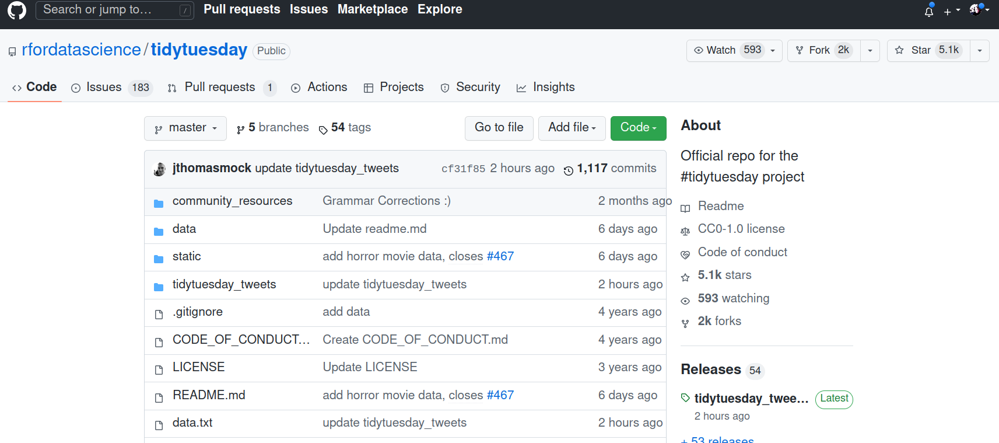
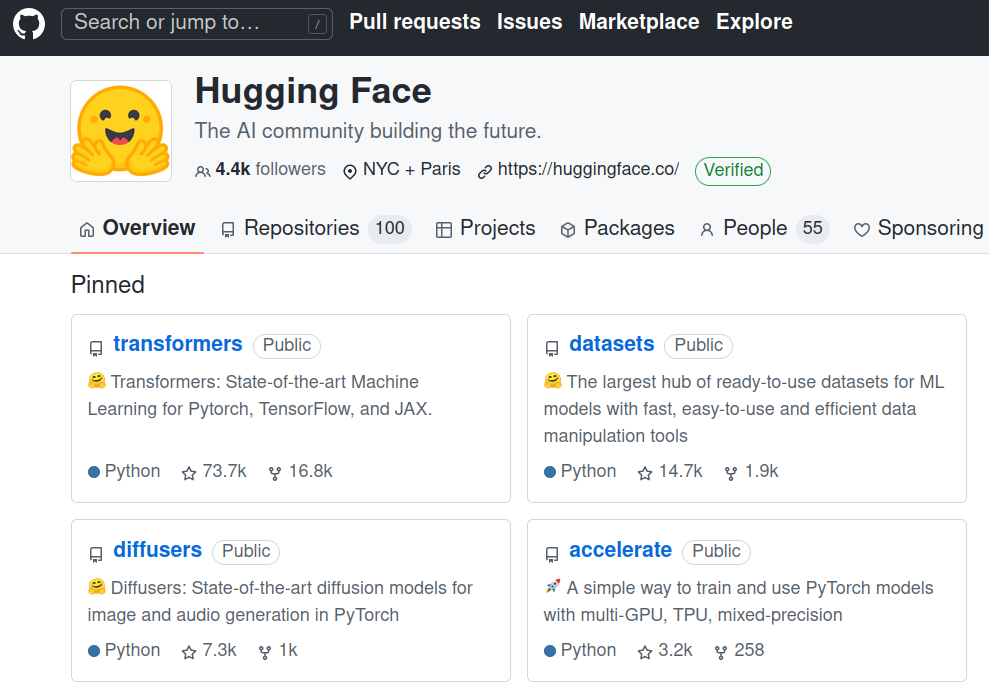
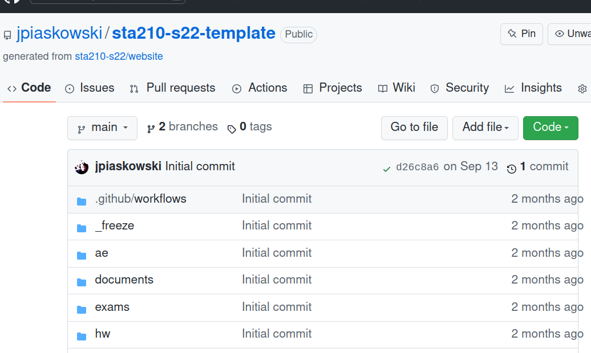
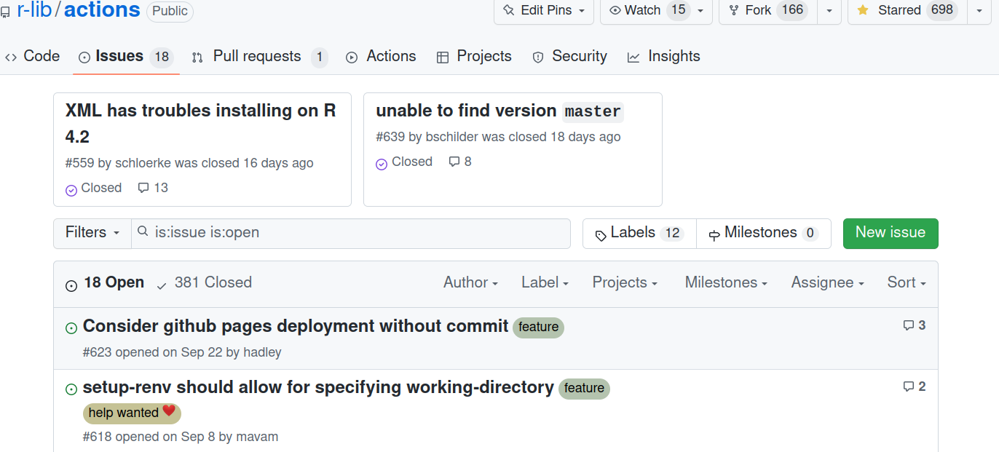
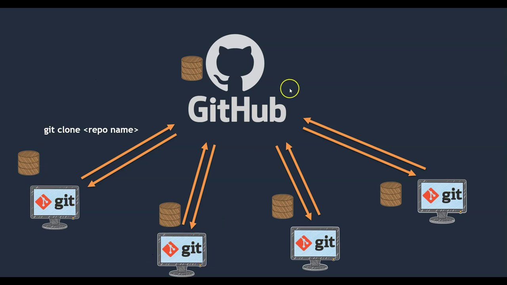
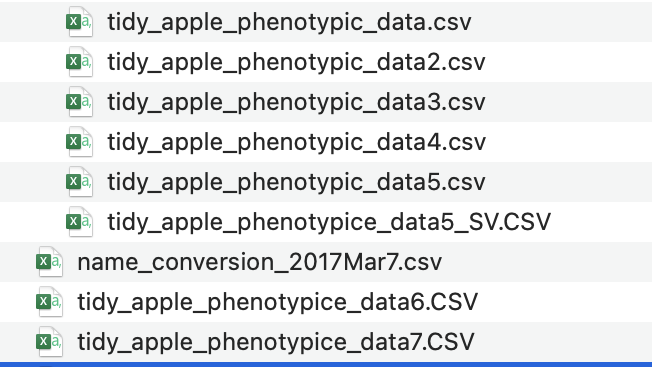
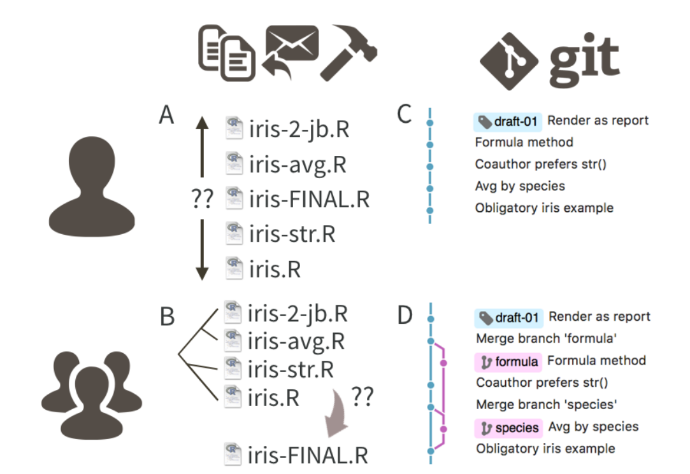
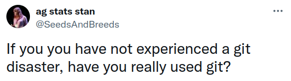
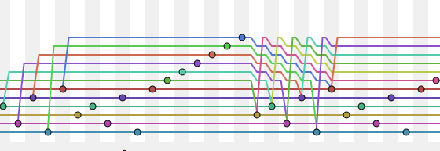

```{r setup, include=FALSE}
options(htmltools.dir.version = FALSE)
knitr::opts_chunk$set(echo = FALSE, message=FALSE, warning=FALSE)
knitr::opts_chunk$set(tidy.opts = list(width.cutoff = 60), tidy = TRUE)
```

# What Do I use git & GitHub for? 


### 1. Share and access data
### 2. Collaborate
### 3. Build things


[GitHub Octocat](https://octodex.github.com/)

---
# Share & Access Data/Software/Demos



[Tidy Tuesday datasets](https://github.com/rfordatascience/tidytuesday)

---
# Share & Access Data/Software/Demos



[Hugging Face Deep Learning Tools](https://github.com/huggingface)

---
# Fork (copy) Project



[Website fork example](https://github.com/jpiaskowski/sta210-s22-template)

---
# Collaborate: File Issues

- find out if someone else has experience a problem similar to yours  
- Point out a bug  
- request a feature



[R GitHub Actions example](https://github.com/r-lib/actions/issues)

---
# Collaboration with Others

> Collaboration is the most compelling reason to manage a project with Git and GitHub.
My definition of collaboration includes hands-on participation by multiple people, including your past and future self, as well as an asymmetric model, in which some people are active makers and others only read or review.

[J. Bryan, *Peer J* (2017)](https://peerj.com/preprints/3159/)

---
# git vs. GitHub



---
# Version Control

Version control captures changes across files, describing the difference between each and maintaining a linear history that can be rewound if needed. 


---
# Why Might You Need This? 
 
To clarify your data curation and analysis process for *research reproducibility*

* files change over time
* results may be shared
* many people are contributing to a project

> ...reproducibility is obtaining consistent results using the same input data; computational steps, methods, and code; and conditions of analysis. 

            - Reproducibility and Replicability in Science (2018)
               National Academies of Sciences

.right[.ref[*[Reference](https://www.nationalacademies.org/our-work/reproducibility-and-replicability-in-science)*]

---
# Why Might You Need This? 

You are probably already implementing ad hoc version control. 


---
# What It Could Look Like



---
# Version Control Advantages

* Sharing for asynchronous work - no more "data_final_KC_EP_JLP_BP.csv" or wondering if you have the most recent version of files  
* Abundantly clear what is the central or main version of files   
* Very advanced version of "track changes"  
* commits create safety points in case of disaster - you can recover pervious version
* branching creates space for experimentation - if all ends in failure, delete the experimental branch, return to the main branch and carry on like nothing happened

---
# Generate a Web Presence


---
# Post a Tutorial as an online book

---
# Run a course

---
# Documentation for your software


---
# What is Git and GitHub not suitable for

* Making publication data sets available - this is not an appropriate long-term repository (just ask the National Academy of Sciences!)
* Tracking changes in binary files (.doc, .docx, .xls, .xlsx, .pdf)

There are special tools to work with large files - make sure you use those if your files are large!  

---
# Things Can Go Wrong With Version Control


[Snark GitHub Badges](https://github.com/Flet/rejected-github-profile-achievements)

---
# Lesson 1: Take Learning git Seriously


[xkcd cartoon](https://xkcd.com/1597/)

---
# Learning git

Those 2-hour workshops are a good way to get started! But more training is needed. 

You will find yourself in a sticky situation that only you can resolve. Do you want to implement a mystery solution you found on Stack Overflow and rick data loss??

Decent options: 

  * [Happy Git with R](https://happygitwithr.com/)
  * [Software Carpentry git workshop](https://swcarpentry.github.io/git-novice/)
  * [Thee book of git](https://git-scm.com/book/en/v2)
  
---
# Lesson 2: Use a Git Client


---
# Some Graphical User Interfaces

* GitHub GUI
* Git Kraken
* SourceTree
* ....[tons more](https://git-scm.com/downloads/guis)

The goal is to become accustomed to using git regularly - use the tools that help you reach that. 

---
# Lesson 3: Be Patient When an Error Occurs

When the inevitable error happens:
  * a merge error
  * can't pull or push!
  * a `git revert` gone horribly wrong
  
**Proceed with caution!**


All can be untangled - if you act wisely. It's also very possible to make things irreversibly worse! 

---
# Lesson 4: Don't Expose Secrets

* Learn about and use the `.gitignore` file
* Consider private repositories when appropriate
* There are some guidelines regarding legal compliance (e.g. [HIPAA](https://github.com/truevault/hipaa-compliance-developers-guide))

---
# Git a Humbling Experience



---
# In the End, git is Worth it

1[](git_talk/yogitocat.png)

---
# Guitar Hero git



.right[.ref[*[original tweet](https://twitter.com/HenryHoffman/status/694184106440200192)]]


